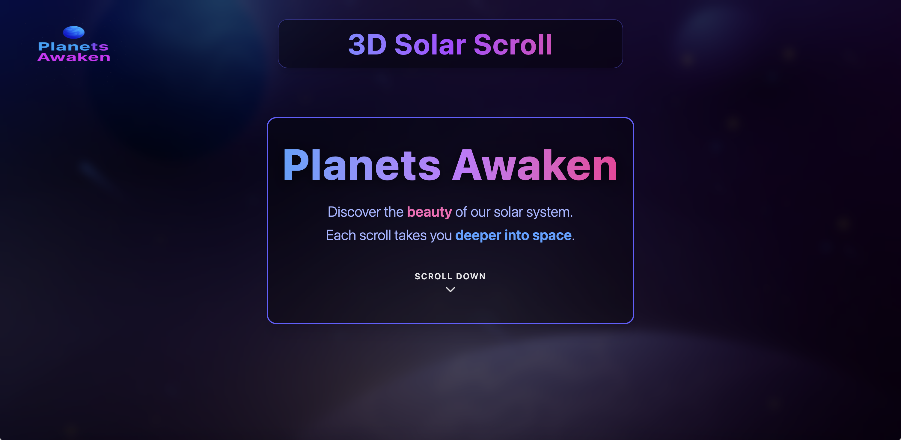
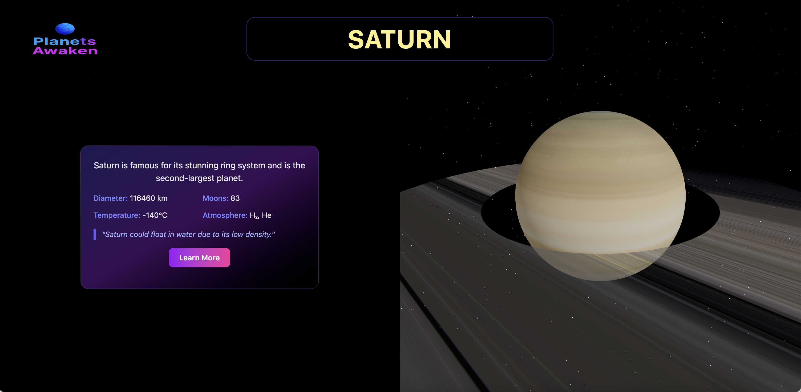

# 🌌 Planets Awaken – 3D Solar Experience

Planets Awaken is an interactive scroll-based 3D journey through our solar system. Built with React Three Fiber, GSAP ScrollTrigger, and TypeScript, it combines smooth animations, immersive visuals, and responsive design to showcase modern web development skills.
---

## Live Demo 👉 [planets-awaken.com](https://planets-awaken.com)

---

## 📸 Screenshots

<p align="center">
  <h2>Home page</h2>
  
</p>
<p align="center">
  <h2 width="45%">Earth</h2>
  
</p>
<p>
  <h2 width="45%">Saturn</h2>
  
</p>

---

## 🚀 Features
- **Modern Tech Stack** → React + Vite + TypeScript  
- **3D & Interactive** → React Three Fiber + Drei + GSAP ScrollTrigger  
- **Advanced Scroll Experience** → Horizontal scene snapping, smooth animations, sticky final scene  
- **Cinematic Design** → Gradient backgrounds, animated transitions, and dynamic camera movement  


---

## ⚡ Getting Started
Clone & run locally:

```bash
git clone https://github.com/puhaivan/Solar-Scroll-3D-.git
cd Solar-Scroll-3D-
npm install
npm run dev
``` 

---


## 📬 Contact
[LinkedIn](https://www.linkedin.com/in/ivan-puga/)
[Email Me](mailto:unsaightly@gmail.com)

